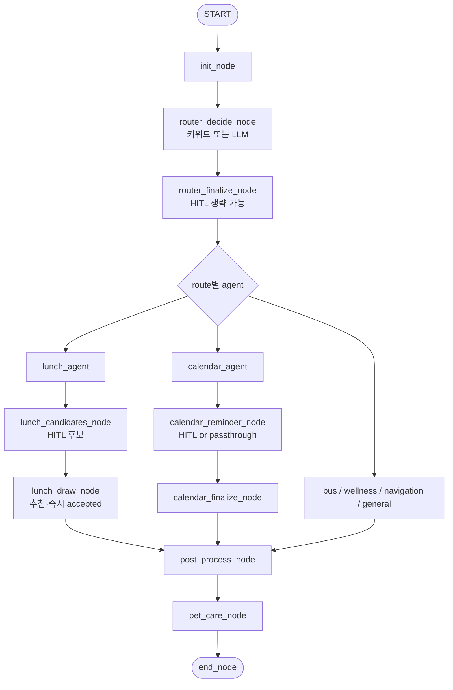

# Smart Office Life Agent

> "나의 업무 리듬과 개발 성향을 이해하고 함께 성장하는 반려 비서."

외부 API(카카오 맵/버스, Google Calendar)와 사용자의 PC/브라우저 활동 데이터를 결합해 직장인의 업무 생산성을 높이고 멘탈 케어를 돕는 **Google ADK 2.0** 기반 에이전트.

## 아키텍처 두 트랙

| 경로 | 엔진 | 용도 |
|------|------|------|
| 탭 버튼 (상태/버스/길찾기/점심/일정) | `google.adk.Workflow` (Graph) | 단발 UI 액션 · 빠른 응답 |
| **대화창 (펫 탭)** | `google.adk.Workflow` (Graph) — `pet_agent` | LLM 라우터 + route별 Sub-agent + 점심/캘린더 **비-LLM HITL** |

두 경로 모두 최종적으로 펫 EXP/스트레스 갱신 로직으로 수렴한다. 대화창은 `router_decide_node` → `router_finalize_node` → 도메인 에이전트 → (필요 시) `lunch_hitl` / `calendar_hitl` → `post_process_node` → `pet_care_node` 순으로 처리된다. 라우터는 `src/agent/router.py`에서 **키워드 fast-path**로 의도가 명확하면 LLM·의도 확인 HITL을 건너뛴다.

### 펫 채팅 그래프: Sub-agent 와 Node

`pet_chat_workflow` (`src/agent/pet_agent.py`)는 **Sub-agent(ADK `Agent`)** 와 **Node(일반 워크플로 노드)** 를 같은 `google.adk.Workflow` 엣지로 묶어 동작한다.

| 구분 | 역할 | 코드 위치 |
|------|------|-------------|
| **Sub-agent** | LLM + `FunctionTool` 등으로 사용자 질문에 답한다. 라우터가 고른 route 문자열과 `Agent.name` 이 같아야 `pet_agent`의 `_ROUTE_TO_AGENT` 매핑에 걸린다. | `src/agent/subagents/` — `bus_agent`, `lunch_agent`, `calendar_agent`, `navigation_agent`, `wellness_coach`, `general_chat_agent` |
| **공통 Node** | 입력 정규화·보상 정책·DB 반영·최종 메시지. LLM 없음. | `src/agent/nodes.py` — `init_node`, `post_process_node`, `pet_care_node`, `end_node` |
| **라우터 Node** | 의도 분류·(선택) 의도 확인 HITL·최종 route 확정. | `src/agent/router.py` — `router_decide_node`, `router_finalize_node` |
| **도메인 HITL Node** | 점심 후보·캘린더 알림 등 `RequestInput` / `ctx.state` 만 사용 (비-LLM). Sub-agent 출력을 입력으로 받는다. | `src/agent/lunch_hitl.py`, `src/agent/calendar_hitl.py` |

- **`post_process_node`** 는 route·HITL 상태만 보고 EXP/stress 숫자를 정한 뒤, 응답 텍스트까지 **`AgentOutput`** 한 덩어리로 만든다.
- **`pet_care_node`** 는 `AgentOutput`을 받아 펫 DB를 갱신한다.
- 버스 **`ask_user_tool`** 은 Sub-agent 툴 안에서 `src/agent/hitl.py` 의 **`GetInput`**(interrupt/재개) 패턴을 쓴다. 점심·캘린더 HITL과는 구현이 다르다.

---

## 1. 시스템 요구사항
- Python 3.11+
- `uv` (권장) 또는 pip
- Docker & Docker Compose (PostgreSQL 기반)
- macOS 에서 `pynput` 사용 시 **접근성(Accessibility) 권한** 필요

## 2. 빠른 시작

```bash
# 1) env 복사
cp .env.example .env

# 2) PostgreSQL 컨테이너 기동 (스키마 init 스크립트 자동 적용)
docker-compose -f docker/docker-compose.yaml up -d db

# 3) Python 의존성
uv sync
# (pytest 등 개발 의존성까지: uv sync --group dev)

# 4) DB 스키마/테이블 생성
uv run python -m src.main --mode init-db

# 5) 테스트 사용자 주입 + 데스크톱 위젯 실행
uv run python -m src.main --mode seed
uv run python -m src.main --mode desktop --user-id 1
# 브라우저 탭으로 띄우고 싶을 때만
uv run python -m src.main --mode web --user-id 1
```

**길찾기 미니 지도**: `.env`에 `KAKAO_MAPS_JAVASCRIPT_APP_KEY`(카카오 지도 JS 키)를 넣으면 위젯 안에 지도가 뜹니다. 파란 선은 자동차 도로 기준이며, 대중교통은 링크로 엽니다. 도로 좌표는 `KAKAO_REST_KEY`로 카카오모빌리티 길찾기 API를 호출해 얻습니다.

## 3. 실행 모드
| 모드 | 명령 | 설명 |
|------|------|------|
| `desktop` (기본) | `uv run python -m src.main --mode desktop --user-id 1` | **pywebview(WKWebView) 기반 네이티브 창.** 브라우저 탭이 아니라 독립 앱 창처럼 뜬다. 옵션: `--on-top` (항상 위), `--frameless` (타이틀바 제거), `--width/--height`. |
| `web` | `uv run python -m src.main --mode web --user-id 1` | FastAPI 위젯을 브라우저 탭으로 연다. pywebview 없이도 동작. |
| `scheduler` | `uv run python -m src.main --mode scheduler` | APScheduler 로 시스템 모니터/버스 알림/펫 스트레스 decay 를 주기 실행. |
| `seed` | `uv run python -m src.main --mode seed --channel C123` | 테스트 사용자 주입. |
| `init-db` | `uv run python -m src.main --mode init-db` | 스키마/테이블 보장. |

### 펫 대화창 에이전트 구조 (Router + Sub-agent + Node)
- 위젯 하단 **대화** 탭은 `src/agent/pet_agent.py` 의 `pet_chat_workflow` (`google.adk.Workflow`) 그래프로 동작한다. 위 표의 **Sub-agent / Node** 조합으로 엣지가 정의된다.
- 라우터 (`src/agent/router.py`):
  - 메시지에 버스·점심·일정·길찾기·웰니스 등 **키워드/역명 패턴**이 맞으면 `_keyword_route`로 route를 바로 정하고, 이 경우 `router_decide_node`가 **`RequestInput`(의도 확인)** 을 내지 않는다.
  - 그 외에는 `router_decide_node`가 LLM(genai JSON)으로 후보 route를 정한 뒤, 사용자에게 추정 route 확인을 요청한다.
  - `router_finalize_node`는 HITL 재개 입력을 받아 최종 route를 확정한다. 짧은 긍정(예: 네, 응, ok, accept)이면 추정 route를 그대로 쓰고, 아니면 키워드 재시도 후 필요 시 LLM으로 재분류한다.
- 도메인 분기:
  - `bus_agent` / `wellness_coach` / `navigation_agent` / `general_chat_agent` 는 각 에이전트 실행 후 바로 `post_process_node` (`navigation_agent` 는 카카오맵 웹 길찾기 링크 등).
  - `lunch_agent` → `lunch_candidates_node`(**후보 1회 HITL**: accept / edit / cancel) → `lunch_draw_node`(추첨) → `post_process_node`. 추첨 직후 **`pending_lunch_status: accepted`** 로 끝나며, 예전에 쓰이던 추첨 결과 재확인 HITL은 **그래프에 연결되어 있지 않다** (`lunch_finalize_node`는 모듈에만 남아 단위 테스트 등에서 사용).
  - `calendar_agent` → `calendar_reminder_node`(HITL 또는 패스스루) → `calendar_finalize_node` → `post_process_node`.
- 공통 종료 체인:
  - `post_process_node` 에서 route별 보상 정책 계산
  - `pet_care_node` 에서 EXP/stress DB 반영
  - `end_node` 에서 최종 사용자 메시지 반환
- 핵심 포인트:
  - 점심 후보·캘린더 HITL 노드는 **LLM 없이** `RequestInput + ctx.state` 기반으로 동작한다.
  - 상태 키 `pending_lunch_status` / `pending_calendar_status` 로 `post_process_node` 의 펫 보상 판별을 오버라이드한다.
  - 라우터·점심 후보처럼 `RequestInput` 이 있는 단계는 동일 세션에서 interrupt/resume 으로 이어진다.


## 4. 아키텍처 (Chat — Sub-agent + Node Workflow)



- 다이어그램에서 `router_decide_node` → `router_finalize_node` 는 항상 이어지지만, 키워드 fast-path일 때는 decide 단계에서 **의도 확인 `RequestInput` 없이** finalize 로 넘어간다.